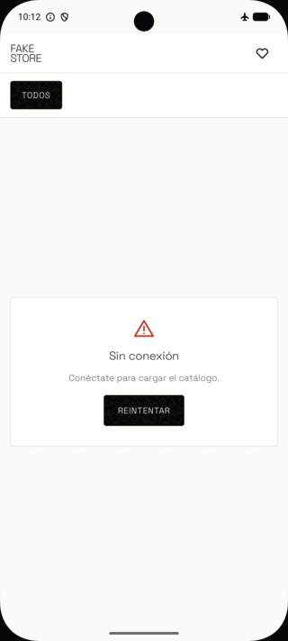
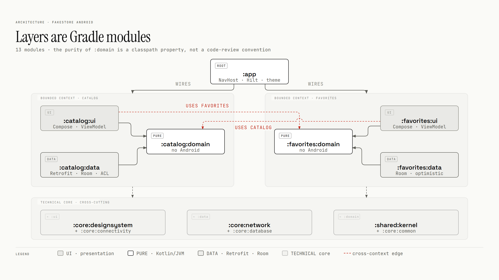

# FakeStore Android

A personal Android lab: an offline-first product catalog, small enough to finish and real enough to
practice architecture, testing and tooling on. Multi-module DDD + Clean Architecture, Compose, Room as
the single source of truth, and a build that enforces the dependency rules.

[](https://github.com/gustavo-pedreros/fakestore-android/actions/workflows/build.yml)
[](https://codecov.io/gh/gustavo-pedreros/fakestore-android)


[](LICENSE)

<table>
  <tr>
    <td align="center"><br><sub><b>Catalog</b><br>grid + category filter</sub></td>
    <td align="center"><br><sub><b>Detail</b><br>image, price, rating</sub></td>
    <td align="center"><br><sub><b>Favorites</b><br>survive process death</sub></td>
    <td align="center"><br><sub><b>Offline</b><br>cached data + banner</sub></td>
    <td align="center"><br><sub><b>Back online</b><br>retries by itself</sub></td>
  </tr>
</table>

## What this repo demonstrates

| Concept | Where it lives | Doc |
|---|---|---|
| Bounded contexts as module groups | [`catalog/`](catalog/), [`favorites/`](favorites/), [`shared/kernel/`](shared/kernel/) | [Architecture](docs/architecture.md#contexts-and-layers) |
| Dependency rule by classpath: `domain` is pure Kotlin/JVM | [`JvmLibraryConventionPlugin.kt`](build-logic/convention/src/main/kotlin/cl/gus/labs/fakestore/convention/JvmLibraryConventionPlugin.kt) | [Architecture](docs/architecture.md#dependency-rules) |
| Offline-first with Room as the single source of truth | [`CatalogRepositoryImpl.kt`](catalog/data/src/main/kotlin/cl/gus/labs/fakestore/catalog/data/CatalogRepositoryImpl.kt), [`ProductDao.kt`](core/database/src/main/kotlin/cl/gus/labs/fakestore/core/database/dao/ProductDao.kt) | [Offline-first](docs/offline-first.md) |
| The cache decides the error; retry on reconnect | [`CatalogViewModel.kt`](catalog/ui/src/main/kotlin/cl/gus/labs/fakestore/catalog/ui/catalog/CatalogViewModel.kt), [`ConnectivityNetworkMonitor.kt`](core/connectivity/src/main/kotlin/cl/gus/labs/fakestore/core/connectivity/ConnectivityNetworkMonitor.kt) | [Offline-first](docs/offline-first.md#the-cache-decides-whether-an-error-blocks) |
| Atomic design as a module | [`core/designsystem/`](core/designsystem/) | [Design system](docs/design-system.md) |
| Navigation 3 with entries owned by each feature | [`CatalogNavigation.kt`](catalog/ui/src/main/kotlin/cl/gus/labs/fakestore/catalog/ui/navigation/CatalogNavigation.kt), [`FakeStoreNavHost.kt`](app/src/main/java/cl/gus/labs/fakestore/navigation/FakeStoreNavHost.kt) | [Architecture](docs/architecture.md#navigation) |
| Build logic in convention plugins | [`build-logic/convention/`](build-logic/convention/src/main/kotlin/cl/gus/labs/fakestore/convention/) | [Architecture](docs/architecture.md#convention-plugins) |
| Screenshot tests on the JVM, no mocking library | [`PreviewScreenshotTest.kt`](core/designsystem/src/test/kotlin/cl/gus/labs/fakestore/core/designsystem/PreviewScreenshotTest.kt), [`core/testing/`](core/testing/) | [Testing](docs/testing.md#screenshots) |
| Coverage gate with a ratchet, split by layer | [`codecov.yml`](codecov.yml), [`KoverRootConventionPlugin.kt`](build-logic/convention/src/main/kotlin/cl/gus/labs/fakestore/convention/KoverRootConventionPlugin.kt) | [Testing](docs/testing.md#coverage) |

## Architecture at a glance

- **Bounded contexts are module groups:** `catalog` and `favorites`, each with `ui`, `domain` and `data`.
- **Layers are modules:** `ui → domain ← data`. `domain` is pure Kotlin/JVM, so neither Android nor
  Retrofit is on its classpath.
- **Contexts meet only in presentation:** a `ui` may use the other context's `domain`; nothing below
  crosses.



## Testing at a glance

Every test runs on the JVM inside `./gradlew build`, screenshots included. Codecov gates each pull
request with a ratchet on the merged Kover report.


Coverage on `main` · domain  · data  · presentation  · design system  · infrastructure 

## Stack

| Area | Choice |
|---|---|
| Language | Kotlin, Coroutines and Flow |
| UI | Jetpack Compose, Material 3, Navigation 3 |
| DI | Hilt with KSP |
| Network | Retrofit, OkHttp, kotlinx.serialization |
| Persistence | Room, with exported schemas |
| Images | Coil |
| Tests | JUnit 5, Turbine, MockWebServer, Robolectric, Roborazzi |
| Build and CI | Convention plugins, version catalog, Kover, Codecov, GitHub Actions |

## Quick start

Requires JDK 21 and an Android SDK with its licenses accepted, through `ANDROID_HOME` or `sdk.dir` in
`local.properties`.

```bash
./gradlew build            # compile, test and lint every module
./gradlew :app:installDebug
```

On Windows, use `gradlew.bat`. Every green CI run also publishes the debug APK, `fakestore-debug-apk`,
on the [workflow page](https://github.com/gustavo-pedreros/fakestore-android/actions/workflows/build.yml).
The first launch needs a network connection: there is no mock backend.

## Docs

| Doc | Question it answers |
|---|---|
| [Architecture](docs/architecture.md) | Which modules exist, which dependencies are allowed, and how is each rule checked? |
| [Offline-first](docs/offline-first.md) | Where does the data come from, and what does the user see when the network fails? |
| [Design system](docs/design-system.md) | Where does each piece of UI live, and what did the design settle? |
| [UI gallery](docs/ui-gallery.md) | What does every component and screen look like today, in light and dark? |
| [Testing](docs/testing.md) | Which test protects each layer, what gates a merge, and how do screenshots work? |
| [Decisions](docs/decisions.md) | What did each key decision buy, what did it cost, and when would I choose otherwise? |
| [Roadmap](docs/roadmap.md) | What comes now, next and later? |
| [Own API and SDUI](docs/proposals/sdui-and-own-api.md) | How would server-driven UI and a sync API fit offline-first? |

## Influences

- **[Now in Android](https://github.com/android/nowinandroid):** convention plugins, test doubles over
  mocks, screenshot tests.
- **Google's [guide to app architecture](https://developer.android.com/topic/architecture):**
  unidirectional data flow and a single source of truth.
- **Clean Architecture:** the dependency rule, enforced by the classpath.
- **Domain-Driven Design:** bounded contexts as module groups that meet only in presentation.

Where each one shows in the code, and where I depart from it: [influences](docs/influences.md).

## Roadmap, origin and license

- **Roadmap:** [now, next and later](docs/roadmap.md).
- **Origin:** a four-day take-home challenge (21–24 Aug 2026). That delivery is tagged
  [`v1.0.0`](https://github.com/gustavo-pedreros/fakestore-android/releases/tag/v1.0.0).
- **License:** [MIT](LICENSE). The bundled fonts are under the SIL Open Font License 1.1.
