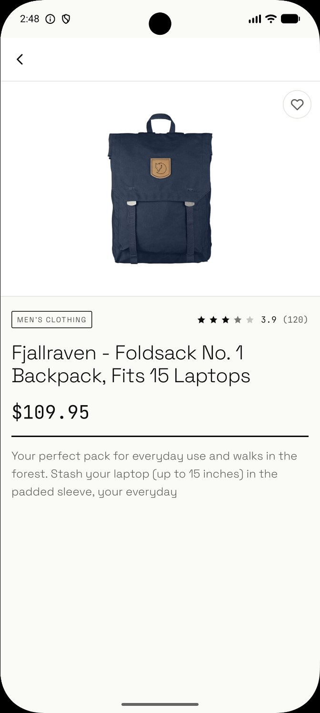
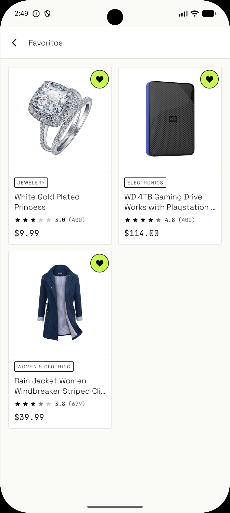
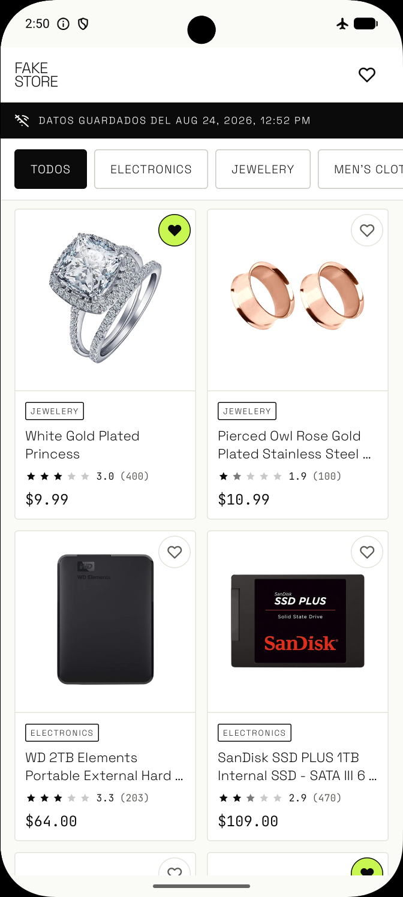
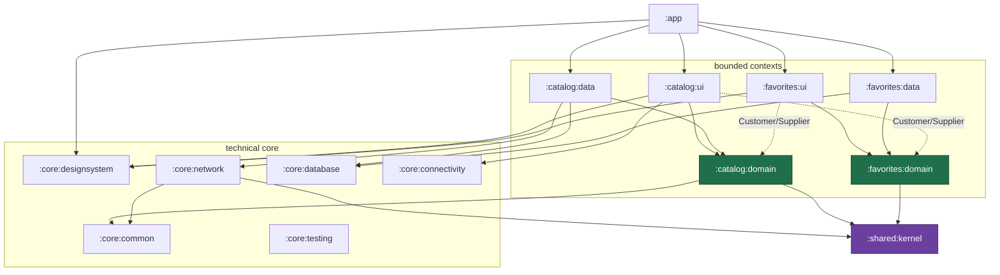
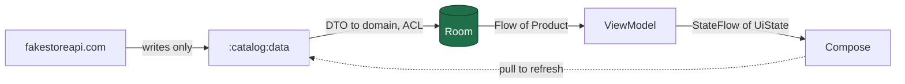
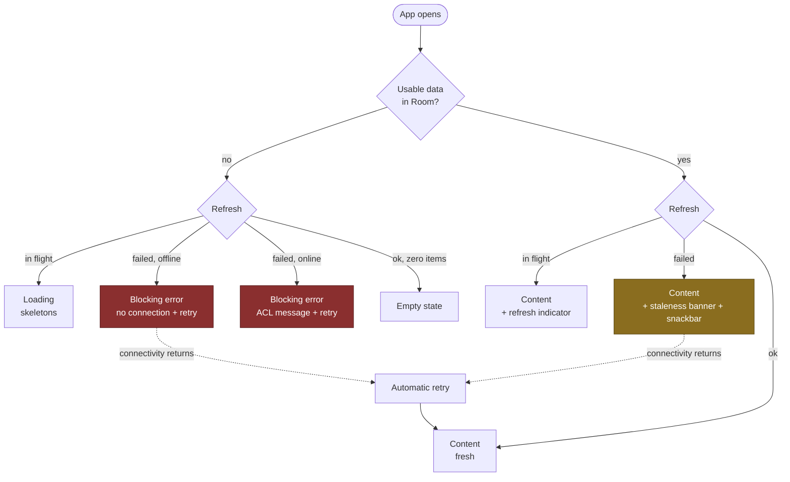
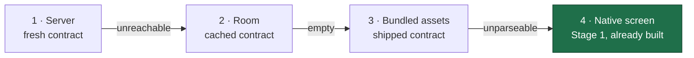

# FakeStore Android

An offline-first product catalog built as a **multi-module DDD + Clean Architecture** Android app.
Kotlin, Compose, Room as the single source of truth, and a module graph where the *build itself*
enforces the architecture.

[](https://github.com/gustavo-pedreros/fakestore-android/actions/workflows/build.yml)


---

## Screenshots

<table>
  <tr>
    <td align="center"><br><sub><b>Catalog</b><br>grid + category filter</sub></td>
    <td align="center"><br><sub><b>Detail</b><br>image, price, category, rating</sub></td>
    <td align="center"><br><sub><b>Favorites</b><br>survives process death</sub></td>
    <td align="center"><br><sub><b>Offline</b><br>cached data + staleness banner</sub></td>
  </tr>
</table>

---

## What the challenge asked, and where it lives

| # | Requirement | Status | Where |
|---|---|---|---|
| 1 | Product list with image, title and price, plus loading and error states | ✅ | `catalog/ui/catalog/` — four content states, 13 ViewModel tests |
| 2 | Detail screen with large image, title, description, price and category | ✅ | `catalog/ui/detail/` |
| 3 | Favorites that survive a restart | ✅ | `favorites/` — three modules over a Room table |
| 4 | Offline cache with a visual indicator for cached data | ✅ | Room is the SSOT; `FsStatusBanner` shows the age of the data |
| ★ | *"Desirable: build your own API"* | 📋 **Designed, not built** | [Roadmap](#roadmap--designed-not-built) |
| ★ | *"If you pull off server-driven UI you're a rockstar"* | 📋 **Designed, not built** | [Roadmap](#roadmap--designed-not-built) |

The two bonuses were scoped, designed and written down before the deadline made the call. What that design
looks like is at the bottom of this file — including the piece that makes SDUI and offline-first compatible
instead of mutually exclusive. Shipping a half-wired engine would have communicated less than shipping the
design and a solid Stage 1.

---

## Quick start

Requires **JDK 21**. Everything else — Gradle 9.5.0, the Android SDK platform, the Kotlin toolchain — is
resolved by the wrapper.

```bash
git clone https://github.com/gustavo-pedreros/fakestore-android.git
cd fakestore-android

./gradlew build            # compiles every module, runs 87 tests, runs lint
./gradlew :app:installDebug
```

Prefer not to build it? Every green CI run publishes the debug APK as a downloadable artifact —
open the [latest run](https://github.com/gustavo-pedreros/fakestore-android/actions/workflows/build.yml)
and grab `fakestore-debug-apk`.

> **The first launch needs a network connection.** There is no mock interceptor and no bundled fixtures:
> in debug and in release the app talks to `https://fakestoreapi.com/`. That is a deliberate decision — see
> [Key decisions](#key-decisions) #5 — and it is why the cold-start-without-cache path had to be designed
> for real rather than hidden behind canned responses.

---

## Architecture

Two ideas, applied at different scales:

- **DDD decides the boundaries *between* modules.** Each bounded context — `catalog`, `favorites` — is a
  group of Gradle modules, not a package.
- **Clean Architecture decides the structure *inside* a context.** `ui → domain ← data`, with dependency
  inversion at the `domain` seam.

The consequence worth stating plainly: **layers are Gradle modules, so purity is a classpath property, not a
code-review convention.** You cannot accidentally import Retrofit into `:catalog:domain`, because Retrofit is
not on its classpath. The tool enforces the rule; nobody has to remember it.

### Module graph



The two dashed edges are the interesting ones. They are the same rule fired in both directions: the catalog
needs to know *which products are favorites* to draw its hearts, and the favorites screen needs to know
*what a product looks like* to draw its cards. Both cross at `domain` level, which is the only level where
crossing is allowed.

`:core:testing` sits apart on purpose. The `fakestore.testing` convention plugin puts it on the test
classpath of every module, so drawing those thirteen edges would bury the production graph under
test-only wiring that no production code can see.

### Dependency rules

1. `*:domain` is **pure Kotlin/JVM** — no Android, no Retrofit, no Room, no Compose.
2. `*:data` implements the interfaces its own `*:domain` declares. Hilt wires them at runtime.
3. `*:ui` depends on `*:domain` (**never** on `*:data`), on `:core:designsystem`, and on technical `:core:*`
   modules that carry neither UI nor persistence.
4. **Contexts cross only at `domain` level.** A `data` module never depends on another context — that would
   be an invisible coupling with a database on the far side of it.
5. `:shared:kernel` is small and governed: something only moves in once **two** contexts genuinely speak it.
   Today that is exactly two types — `ProductId` and `AppError`.

Rules 1–4 are verifiable from the classpath, which is what makes them worth writing down. Mechanising that
verification is Stage 4 of the roadmap.

---

## How offline-first actually works

### Room is the single source of truth

The UI **only ever reads from Room**, through a `Flow`. The network **only ever writes to Room**, and never
feeds the UI directly. There is exactly one arrow into the database and exactly one arrow out of it.



This is why requirement 4 is a *property of the architecture* rather than a feature bolted on top. There is no
"offline mode" branch anywhere in the codebase. Offline is simply what the app does when the write arrow
stops firing and the read arrow keeps working.

### The cache decides whether an error is blocking

The axis that governs the whole catalog presentation is not *"did the network fail?"* — it is
**"is there usable data in Room?"**. A failed refresh must never hide data the user already had.



Two details close the case:

- **The retry is automatic.** `NetworkMonitor` emits the offline→online transition and, if the last refresh
  failed, fires `RefreshCatalog` on its own. The user never has to find the button, and the staleness banner
  closes itself. Verified on an emulator: coming back from airplane mode, you cannot tap Retry fast enough.
- **"No connection" and "the server failed" are different messages.** `AppError.Network` produces
  connectivity-specific copy; everything else goes through the error ACL.

Every row of that diagram is a **ViewModel test with virtual time**, not a manual check.

### Favorites without a foreign key

`products` and `favorites` are two tables with **no foreign key between them**. Favorites stores nothing but
a `productId`. The join happens reactively in the ViewModel — `combine(catalogFlow, favoriteIdsFlow)` with a
`Set<ProductId>` for O(1) lookup.

The cost is an in-memory scan. The benefit is that either context can evolve, or be deleted outright, without
breaking referential integrity on disk. At 20 products the cost is noise; the day it stops being noise, the
trigger is pagination, not table size.

---

## Key decisions

The honest way to present a decision is: **what I gained, what I paid, and when I'd choose otherwise.**

| # | Decision | What I gained | What I paid / when I'd choose otherwise |
|---|---|---|---|
| 1 | **A layer is a Gradle module, not a package** | `domain` purity is guaranteed by the build. Importing Retrofit into a domain module is not a discipline problem — it is a compile error. | 14 modules for two screens; slower syncs and more Gradle friction. On a small team or an exploratory product I would use vertical slices with layers as packages. |
| 2 | **A module group is a bounded context** | A context can be understood, tested and replaced whole. Growing means adding modules, not editing existing ones. | Requires explicit contracts between contexts and the discipline to resist the shortcut. |
| 3 | **Contexts cross only at `domain` level** | The catalog needs to know what is a favorite. Allowing that edge at `domain` (Customer/Supplier) is honest; allowing it at `data` would be an invisible coupling. | It is a rule that must be *verified*, not just written. Hence Stage 4. |
| 4 | **One physical Room database, separate DAOs** | On mobile, N SQLite connections cost memory, battery and migrations. DDD's logical boundaries survive because each `data` module only ever sees its own DAO. | It breaks orthodox purity: entities from several contexts live in one shared technical module. A conscious mobile-pragmatism trade. |
| 5 | **No mock interceptor** | No debug-only code path, nothing extra in the Hilt graph, and the cold start with no cache and no network had to be designed for real. Tests use MockWebServer, which is deterministic without contaminating the product. | You lose the instant offline demo with no backend. Against an unstable or private API, the mock would earn its keep. |
| 6 | **`Double` for price, formatted at the leaf composable** | The API sends `price` as a JSON number and **no currency field**, and nothing in the app does arithmetic on it. No arithmetic means no floating-point error to accumulate. | A `Money` type over `BigDecimal` solves a problem this challenge does not have. It comes back the moment there is a cart, a total or a tax — or a currency field. |
| 7 | **The favorite toggle does not trust the UI's boolean** | The design system hands the ViewModel the `checked` value the user just saw; the use case discards it and lets a `@Transaction` in the DAO read the table and decide. Two fast taps cannot desynchronise anything. | A design-system parameter that is deliberately ignored, which reads like an oversight until you know why. Against a `PUT /favorites/{id} {favorite:true}` backend, an idempotent `setFavorite(id, desired)` fits retries better. |
| 8 | **Navigation 3, with each feature owning its entries** | The back stack is app-owned state, keys are typed and `@Serializable`, and every feature exposes its own `entryProvider` scope. `:app` never learns which screens exist inside a feature — it only owns the stack. | A young library with a smaller ecosystem than Navigation 2. On a codebase already deep in Nav2 with fragments, the migration would not pay for itself. |

Every one of these has a full decision record with its context and alternatives — see
[Design records](#design-records).

---

## Testing

**87 tests across 16 files**, all run by `./gradlew build`.

| Level | What is covered | Tooling |
|---|---|---|
| Kernel & utilities | `Either`, error mapping | JUnit 5 |
| Domain | use cases that carry real logic | JUnit 5 |
| ACL / mappers | DTO → domain, entity → domain | JUnit 5 |
| Data | repositories against fakes; the remote datasource against **MockWebServer** with real payload shapes | JUnit 5 + MockWebServer |
| Persistence | DAO behaviour, including the favorites toggle transaction | Robolectric + JUnit 4 via the vintage engine |
| Presentation | **every state in the diagram above**, with virtual time | JUnit 5 + Turbine + `kotlinx-coroutines-test` |

Two choices show up in the test source and are worth explaining:

- **No mocking library.** Use cases are `fun interface`s, so a test double is a lambda. `MockK` never
  acquired a consumer, so it never entered the version catalog. Fakes that need state are hand-written
  classes of a few lines.
- **Robolectric is confined to `:core:database`.** Because each `data` module talks to a `LocalDataSource`
  *interface* rather than a DAO, repository tests are plain JVM tests. Only the DAO tests — where the real
  SQLite behaviour is the thing under test — pay the Robolectric cost.

---

## Roadmap — designed, not built

Everything below is specified in the design records with the same rigour as what shipped. It is here because
a reviewer should be able to tell what was *out of time* from what was *out of thought*.

### Stage 2 — own API + Server-Driven UI

A Ktor server in the monorepo, a `:shared:contract` module as the Published Language between client and
server, and a `:core:sdui` engine.

The decision that makes SDUI and offline-first compatible: **the server sends structure and bindings, never
hydrated content.**

```jsonc
{ "screenId": "product_list", "contractVersion": 1,
  "root": { "type": "lazy_list", "id": "list", "source": "catalog",
            "itemTemplate": { "type": "product_card", "id": "card",
              "image": "{product.image}", "title": "{product.title}",
              "price": "{product.price}",
              "trailing": { "type": "favorite_toggle", "productId": "{product.id}" } } } }
```

The client resolves those bindings against the domain **already cached in Room**. Cached layout plus cached
data means the app renders a server-driven screen *in airplane mode*. The alternative — a hydrated payload —
forces you to cache rendered screens and breaks the single source of truth.

The other half is refusing to let the server leave you with no UI at all:



Level 4 is the reason the native screens are not throwaway work: they are the floor of the ladder. That is
also why every screen in this repo is assembled from design-system atoms — the SDUI renderer would target
those same atoms.

Stage 2 also turns favorites into a synced entity with last-write-wins reconciliation and optimistic local
writes. The `favorites` table **already ships with the `updatedAt` and `syncState` columns** it will need,
precisely so that adding sync later costs no Room migration.

### Stage 3 — auditability

An `:audit` context recording a durable trail of domain events, as a generic transversal subdomain that any
context's `data` layer may depend on. Not requested by the challenge; included because offline-first systems
that reconcile in the background need a way to answer *"what happened to my data?"*.

### Stage 4 — mechanical verification

Kover for coverage, Konsist for the dependency rules above, ktlint/detekt for style. Rules 1–4 currently live
in this README and in review; Stage 4 is where they become build failures instead of prose.

---

## Module reference

| Module | Type | Responsibility |
|---|---|---|
| `:app` | Android app | Composition root: Hilt graph, back stack, theme |
| `:catalog:domain` | Pure Kotlin | `Product`, `Category`, `Rating`, `CatalogRepository`, five use cases |
| `:catalog:data` | Android lib | Retrofit + Room, DTO→domain ACL, `CatalogRepositoryImpl` |
| `:catalog:ui` | Compose lib | Catalog and detail screens, ViewModels, UI models, nav entries |
| `:favorites:domain` | Pure Kotlin | `FavoritesRepository`, `ObserveFavoriteIds`, `ToggleFavorite` |
| `:favorites:data` | Android lib | Local-first writes over `FavoriteDao` |
| `:favorites:ui` | Compose lib | Favorites screen and its nav entries |
| `:shared:kernel` | Pure Kotlin | Ubiquitous language: `ProductId`, `AppError` |
| `:core:common` | Pure Kotlin | `Either` |
| `:core:network` | Android lib | Retrofit/OkHttp/kotlinx.serialization, `executeCall`, error ACL |
| `:core:database` | Android lib | The single Room instance, entities, DAOs, migrations |
| `:core:designsystem` | Compose lib | M3 theme, tokens, atoms → molecules → organisms, `FsIcons` |
| `:core:connectivity` | Android lib | `NetworkMonitor`: `ConnectivityManager` as a `Flow<Boolean>` |
| `:core:testing` | Pure Kotlin | JUnit 5 extensions shared by every module's tests |

Seven **convention plugins** in `build-logic/` carry the shared build configuration, so a module's
`build.gradle.kts` is usually a plugin list and a handful of dependencies.

---

## Stack

| Area | Choice |
|---|---|
| Language / toolchain | Kotlin 2.3.0, JVM 21, `minSdk 26`, `compileSdk 37` |
| UI | Jetpack Compose (BOM 2026.08.00), Material 3, **Navigation 3** |
| Async | Coroutines + Flow — `StateFlow`, `combine`, `flatMapLatest` |
| DI | Hilt 2.60.1 + KSP |
| Network | Retrofit 3.0.0 + OkHttp 5.4.0 + kotlinx.serialization |
| Persistence | Room 2.8.4, schemas exported and version-controlled |
| Images | Coil 3 with disk cache |
| Time | `kotlin.time.Instant` / `Clock` from the stdlib |
| Test | JUnit 5, Turbine, MockWebServer, Robolectric |

---

## Design records

The full reasoning behind this project — a staged plan and **seven ADRs**, each written as
*what I gained / what I paid / when I'd choose otherwise*, including the corrections made after
implementation proved a decision wrong — lives on the
**[`docs` branch](https://github.com/gustavo-pedreros/fakestore-android/tree/docs/docs)**.

It is kept off `main` on purpose: pull requests here review code, not plans.
