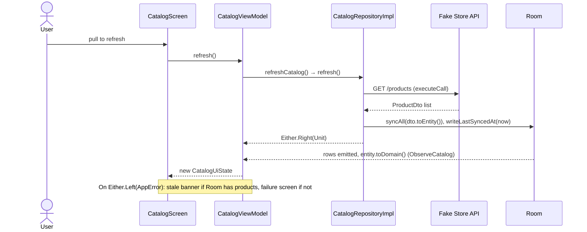

# Architecture

DDD draws the boundaries between modules; Clean Architecture orders the layers inside each context.
Layers are Gradle modules, so most dependency rules are classpath facts. Where a rule is still a
convention, the table below says so.

## Contexts and layers

- **A bounded context is a group of modules.** `catalog` and `favorites` each have `ui`, `domain` and
  `data`.
- **Inside a context, `ui → domain ← data`.** `data` implements the repository interface its `domain`
  declares.
- **Layers are modules.** Retrofit is not on `:catalog:domain`'s classpath, so importing it there does
  not compile.

That last rule buys visibility, not impossibility: adding the dependency to the module's build file
makes it compile, and the diff then shows it. One part is absolute: `*:domain` applies
`org.jetbrains.kotlin.jvm`, so `android.jar` is never on its classpath.

## Module graph

The dashed edges are the only cross-context dependencies, and both start at a `ui`: the catalog needs
favorite IDs to draw its hearts, and the favorites screen needs `Product` to draw its cards. No
`domain` or `data` module depends on another context.

`:core:testing` is not drawn. `fakestore.testing` puts it on the test classpath of every other module,
and those edges carry no production code.

## Dependency rules

| # | Rule | How it is checked today |
|---|---|---|
| 1 | `*:domain` is pure Kotlin/JVM: no Android, Retrofit, Room or Compose | Classpath. One leak: `javax.inject` reaches `:catalog:domain` through [`api(libs.javax.inject)`](../core/common/build.gradle.kts), unused there |
| 2 | `*:data` implements its repository and binds its context's use cases; `*:domain` carries no DI annotation | Hilt validates the bindings at compile time. The annotation rule is review only |
| 3 | `*:ui` depends on `*:domain`, never on `*:data` | Build files. Nothing fails if one adds the edge |
| 4 | Contexts integrate in presentation: a `ui` may use the other context's `domain`; `domain` and `data` never reach another context | Build files. Each `data` using only its own DAO is a convention: every DAO in [`:core:database`](../core/database/src/main/kotlin/cl/gus/labs/fakestore/core/database/dao/) is public |
| 5 | `:shared:kernel` holds only what both contexts speak | Review. Today: [`ProductId` and `AppError`](../shared/kernel/src/main/kotlin/cl/gus/labs/fakestore/shared/kernel/) |

No test enforces these rules yet. Architecture tests are on the [roadmap](roadmap.md#now).

## Context map

- **Shared kernel.** `:shared:kernel` is the only code both contexts own.
- **Anti-corruption layer.** `:catalog:data` translates the API in two steps, DTO → Room entity →
  domain ([`ProductMappers.kt`](../catalog/data/src/main/kotlin/cl/gus/labs/fakestore/catalog/data/mapper/ProductMappers.kt)).
  Transport failures become `AppError` in
  [`ErrorMapper.kt`](../core/network/src/main/kotlin/cl/gus/labs/fakestore/core/network/error/ErrorMapper.kt).
  No DTO and no HTTP type reaches a domain.
- **Integration in presentation.** The contexts meet only in `ui`, through the other context's domain
  API.
- **Planned.** `:shared:contract` as the Published Language of an own API
  ([proposal](proposals/sdui-and-own-api.md)), and an `:audit` context ([roadmap](roadmap.md#later)).

## A refresh, end to end

The screen never receives the network response: the refresh only writes to Room, and the new state
arrives through the same `Flow` the screen already observes.

## Navigation

Navigation 3. `:app` owns the back stack in
[`FakeStoreNavHost.kt`](../app/src/main/java/cl/gus/labs/fakestore/navigation/FakeStoreNavHost.kt);
each feature registers its own entries with typed `@Serializable` keys
([`CatalogNavigation.kt`](../catalog/ui/src/main/kotlin/cl/gus/labs/fakestore/catalog/ui/navigation/CatalogNavigation.kt),
[`FavoritesNavigation.kt`](../favorites/ui/src/main/kotlin/cl/gus/labs/fakestore/favorites/ui/navigation/FavoritesNavigation.kt)).
`:app` never learns which screens a feature has.

## Modules

| Module | Type | Responsibility |
|---|---|---|
| `:app` | Android app | Composition root: Hilt graph, back stack, theme |
| `:catalog:domain` | Kotlin/JVM | `Product`, `Category`, `Rating`, `CatalogRepository`, use cases |
| `:catalog:data` | Android lib | Retrofit and Room behind `CatalogRepositoryImpl`, the ACL |
| `:catalog:ui` | Compose lib | Catalog and detail screens, ViewModels, navigation entries |
| `:favorites:domain` | Kotlin/JVM | `FavoritesRepository`, `ObserveFavoriteIds`, `ToggleFavorite` |
| `:favorites:data` | Android lib | Local-first writes over `FavoriteDao` |
| `:favorites:ui` | Compose lib | Favorites screen and its navigation entries |
| `:shared:kernel` | Kotlin/JVM | Ubiquitous language shared by both contexts |
| `:core:common` | Kotlin/JVM | `Either`, the `@IoDispatcher` qualifier |
| `:core:network` | Android lib | Retrofit, OkHttp and kotlinx.serialization setup, `executeCall`, error ACL |
| `:core:database` | Android lib | The single Room database: entities, DAOs, migrations, exported schemas |
| `:core:designsystem` | Compose lib | Theme, tokens, atoms, molecules and organisms |
| `:core:connectivity` | Android lib | `NetworkMonitor`: `ConnectivityManager` as a `Flow<Boolean>` |
| `:core:testing` | Kotlin/JVM | `MainDispatcherExtension` and the shared test dependencies |

## Convention plugins

A module's `build.gradle.kts` is a plugin list and its dependencies. The shared configuration lives in
[`build-logic/convention`](../build-logic/convention/src/main/kotlin/cl/gus/labs/fakestore/convention/).

| Plugin | Configures |
|---|---|
| `fakestore.jvm.library` | Kotlin/JVM with the project toolchain, and Kover |
| `fakestore.android.library` | AGP library with the shared Kotlin/Android settings, and Kover |
| `fakestore.android.application` | AGP application with the shared Kotlin/Android settings, `targetSdk`, and Kover |
| `fakestore.android.compose` | The Compose compiler; opt-in compiler reports with `-PcomposeCompilerReports` |
| `fakestore.android.compose.testing` | Robolectric and Roborazzi screenshot tests on the JVM ([testing](testing.md#screenshots)) |
| `fakestore.android.hilt` | KSP and Hilt |
| `fakestore.android.room` | KSP and Room, with schemas exported to `schemas/` |
| `fakestore.testing` | JUnit 5, the shared test libraries and `:core:testing` |
| `fakestore.kover` | The module's `coverage` variant (`debug` or `jvm`) and the shared exclusions |
| `fakestore.kover.root` | Merges every module's variant into one report |
