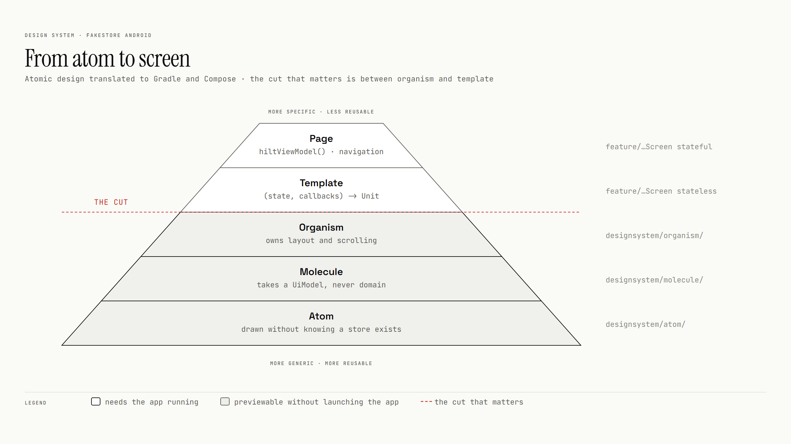
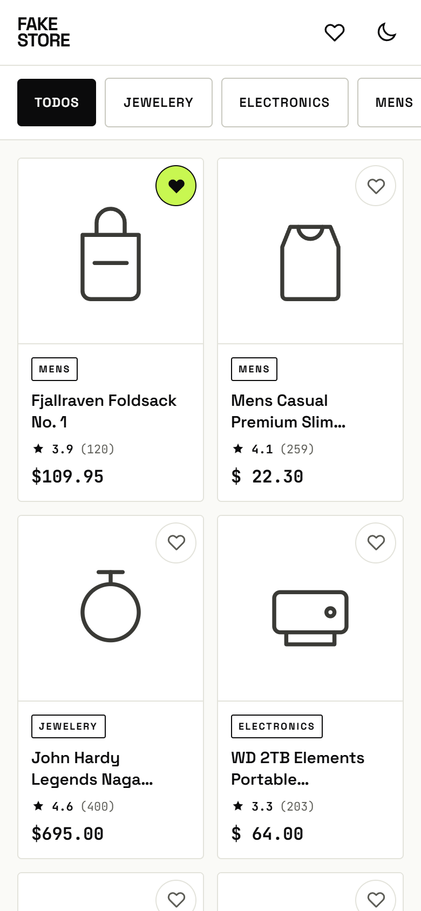
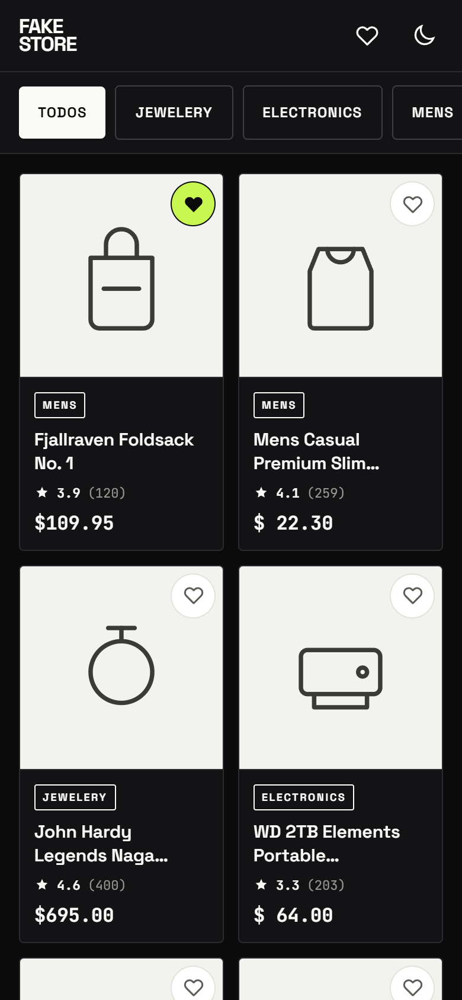
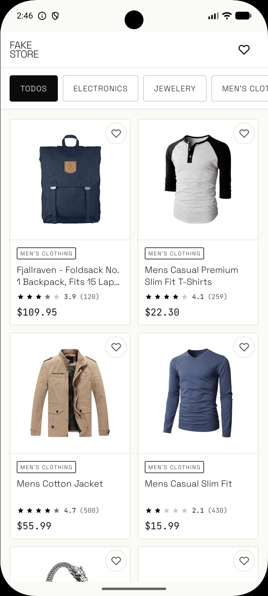

# Design system

Atomic design, translated to Android: atoms, molecules and organisms live in `:core:designsystem`;
templates and pages live in each feature. Everything in the design system renders from a preview,
without the app.

## Atomic design, translated

Atomic design comes from the web, where a page is a file. Android has modules, ViewModels and
navigation, so each layer needed a rule that decides where a file goes:

| Layer | The test it has to pass | Where it lives |
|---|---|---|
| Atom | Can be drawn without knowing a store exists | [`core/designsystem/atom/`](../core/designsystem/src/main/kotlin/cl/gus/labs/fakestore/core/designsystem/atom/) |
| Molecule | Several atoms with one purpose. Takes a UI model, never a domain model | [`core/designsystem/molecule/`](../core/designsystem/src/main/kotlin/cl/gus/labs/fakestore/core/designsystem/molecule/) |
| Organism | Owns the layout and scrolling of a whole section. Still receives lists and lambdas | [`core/designsystem/organism/`](../core/designsystem/src/main/kotlin/cl/gus/labs/fakestore/core/designsystem/organism/) |
| Template | `(state, callbacks) -> Unit`. No ViewModel, no Hilt, no navigation | The feature's stateless `…Screen` |
| Page | The only code that touches `hiltViewModel()` and navigation | The feature's stateful `…Screen` overload |

The cut between organism and template is enforced by the classpath: `:core:designsystem` depends on no
`domain` module, so an atom cannot import `Product`.

The same atoms are what a server-driven renderer would target
([proposal](proposals/sdui-and-own-api.md)), so the native screens are not throwaway work.

## Spec and shipped build

The list screen as specified, in both themes, next to the build:

<table>
  <tr>
    <td align="center"> <b>Spec</b> · light</td>
    <td align="center"> <b>Spec</b> · dark</td>
    <td align="center"> <b>Shipped</b></td>
  </tr>
</table>

The spec's moon icon is a runtime theme toggle. It is not wired yet (the app follows the system
theme); the boards stay as drawn.

## Boards

Exported from the [design canvas](design/canvas/). Each component decision on them states what it
gained, what it cost and when another choice would win, like [the decisions log](decisions.md).

| Board | What it settles |
|---|---|
| [From atom to screen](../art/design-system/atomic-map.png) | The five layers in Kotlin, the file tree, and the one-way dependency rule |
| [Color](../art/design-system/color.png) | The Material 3 roles the app uses, plus a semantic layer on top |
| [Type scale](../art/design-system/type-scale.png) | Space Grotesk and JetBrains Mono, and which text uses each |
| Atoms · [light](../art/design-system/light/atoms.png) · [dark](../art/design-system/dark/atoms.png) | The primitives and their states |
| Molecules · [light](../art/design-system/light/molecules.png) · [dark](../art/design-system/dark/molecules.png) | Cards, banners, top bars, the category row |
| Organisms · [light](../art/design-system/light/organisms.png) · [dark](../art/design-system/dark/organisms.png) | The grid, the skeleton, the detail header and `FsStateHost` |
| Detail screen · [light](../art/design-system/light/product-detail.png) · [dark](../art/design-system/dark/product-detail.png) | The full detail composition |
| List screen · [light](../art/design-system/light/product-list.png) · [dark](../art/design-system/dark/product-list.png) | The full list composition |

The boards are in Spanish and predate the code, so some names drifted: `OfflineBanner` shipped as
`FsStatusBanner`, and each page/template pair shipped as two overloads of one function. They record
what was decided, not the current API.
