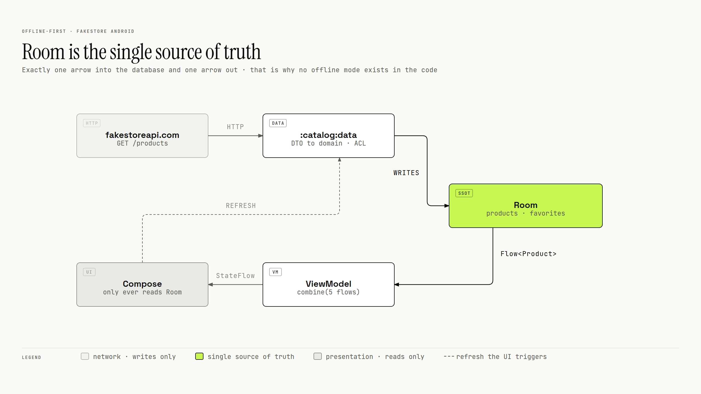
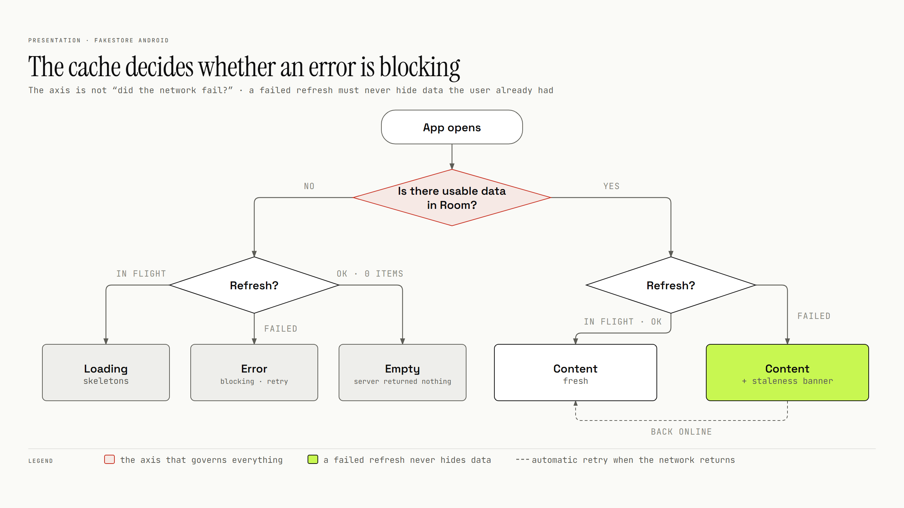

# Offline-first

Room is the single source of truth: the network only writes to it, and the UI only reads from it.
Offline is not a mode; it is what happens when the writes stop. Whether a failure blocks the screen
depends on the cache, not on the network.

## Room as the single source of truth

- The UI observes a `Flow` from Room
  ([`ProductDao.kt`](../core/database/src/main/kotlin/cl/gus/labs/fakestore/core/database/dao/ProductDao.kt)).
- A refresh fetches, maps and writes to Room; it returns only success or an `AppError`
  ([`CatalogRepositoryImpl.kt`](../catalog/data/src/main/kotlin/cl/gus/labs/fakestore/catalog/data/CatalogRepositoryImpl.kt)).
- There is no offline branch anywhere in the code. Offline, the read path keeps working and the write
  path stops.

## The cache decides whether an error blocks

A failed refresh must never hide data the user already has. The question that drives the screen is
*is there usable data in Room?*, not *did the network fail?*

- **No cache.** The failure fills the screen, with a retry button.
- **Cache.** The content stays and a banner shows when it was saved.
- **The retry is automatic.** Both ViewModels watch `NetworkMonitor` and, if the last refresh failed,
  refresh again on the offline → online transition. The banner closes by itself.
- **The copy follows the cause.** Offline, the message is about connectivity whatever the failure was.
  Online, `AppError.Network`, `Http`/`EmptyBody` and `Unknown` each have their own title and body.

Every branch of that tree is a ViewModel test with virtual time
([`CatalogViewModelTest.kt`](../catalog/ui/src/test/kotlin/cl/gus/labs/fakestore/catalog/ui/catalog/CatalogViewModelTest.kt),
[`ProductDetailViewModelTest.kt`](../catalog/ui/src/test/kotlin/cl/gus/labs/fakestore/catalog/ui/detail/ProductDetailViewModelTest.kt)).

## Favorites without a foreign key

`products` and `favorites` share no foreign key; `favorites` stores only a `productId`. Each ViewModel
joins them in memory: `combine` over the catalog and the favorite IDs, with a `Set<ProductId>` for
lookups.

Either context can change, or disappear, without breaking integrity on disk. The price is an
in-memory join, which only matters once the catalog is paginated. See
[decision 9](decisions.md#9-favorites-without-a-foreign-key).

## No mock backend

The app always talks to `https://fakestoreapi.com/`, in debug and in release, so the first launch
needs a network connection. Tests use MockWebServer instead. See
[decision 5](decisions.md#5-no-mock-interceptor).
