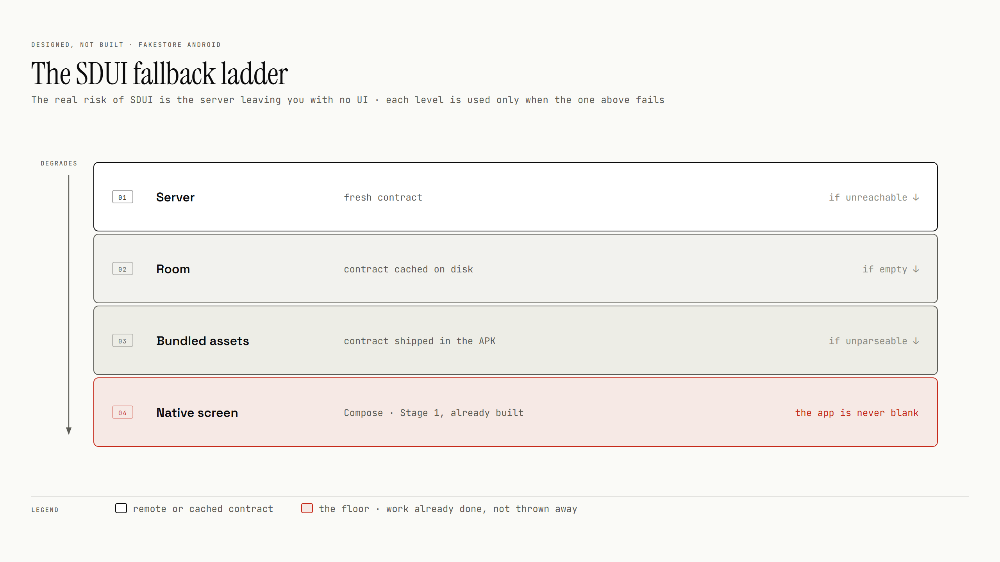

# Proposal: own API and server-driven UI

Designed, not built. A Ktor server in the monorepo, `:shared:contract` as the Published Language
between client and server, and a `:core:sdui` engine. The server sends structure and bindings, never
content, so server-driven screens keep working offline.

## Bindings, not content

The server describes the screen and binds its slots to domain data:

```jsonc
{ "screenId": "product_list", "contractVersion": 1,
  "root": { "type": "lazy_list", "id": "list", "source": "catalog",
            "itemTemplate": { "type": "product_card", "id": "card",
              "image": "{product.image}", "title": "{product.title}",
              "price": "{product.price}",
              "trailing": { "type": "favorite_toggle", "productId": "{product.id}" } } } }
```

The client resolves the bindings against the domain already in Room. A cached layout plus cached data
renders a server-driven screen in airplane mode. A hydrated payload would force caching rendered
screens and break the [single source of truth](../offline-first.md#room-as-the-single-source-of-truth).

## Fallback ladder

The server must never leave the app without UI:



The floor is the native screen that exists today. The renderer targets the same design-system atoms,
so the native screens stay useful ([design system](../design-system.md#atomic-design-translated)).

## Synced favorites

Favorites become a synced entity: optimistic local writes, then last-write-wins reconciliation.


The `favorites` table already has the `updatedAt` and `syncState` columns this needs, so adding sync
costs no migration.
